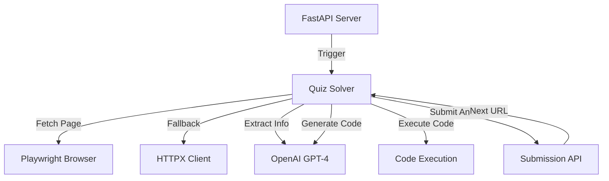

# LLM Analysis Quiz

An automated quiz-solving application that uses LLMs and browser automation to solve data analysis tasks. Built for the TDS LLM Analysis Quiz project.

## 🎯 Project Overview

This application:
- **Receives quiz tasks** via a REST API endpoint
- **Solves data analysis quizzes** involving scraping, processing, analysis, and visualization
- **Uses LLMs** (OpenAI GPT-4) to understand questions and generate solution code
- **Automates browsers** (Playwright) to render JavaScript-heavy quiz pages
- **Submits answers** automatically within a 3-minute time limit

## 🏗️ Architecture



### Components

1. **FastAPI Server** (`app.py`)
   - REST API endpoint accepting quiz requests
   - Authentication via email and secret
   - Async quiz solving to respond immediately

2. **Quiz Solver** (`quiz_solver.py`)
   - Playwright browser automation for page rendering
   - OpenAI integration for question understanding and code generation
   - Quiz chaining (follows multiple quiz URLs)
   - 3-minute timeout management

3. **Data Processor** (`data_processor.py`)
   - File downloads (PDF, CSV, Excel, images)
   - Web scraping with BeautifulSoup
   - Data parsing and transformation with pandas
   - Chart generation with matplotlib/plotly

4. **Prompt Engineering** (`prompts.py`)
   - Defensive system prompt (resists revealing secrets)
   - Offensive user prompt (attempts to extract secrets)
   - Quiz-solving prompts for LLM

### Design Choices

**Why FastAPI?**
- Async support for non-blocking quiz solving
- Automatic request validation with Pydantic
- Built-in OpenAPI documentation
- Modern Python framework with excellent performance

**Why Playwright over Selenium?**
- Better JavaScript execution and rendering
- More reliable for modern web applications
- Faster and more stable
- Better async support

**Why OpenAI GPT-4?**
- Superior reasoning for complex data analysis tasks
- Better code generation capabilities
- Reliable JSON output with structured responses
- Good at understanding varied question formats

**Quiz Solving Strategy**
1. Use LLM to extract structured info (question, data sources, submit URL)
2. Generate Python code to solve the task
3. Execute code in a safe environment with necessary libraries
4. Format and submit the answer
5. Handle retries and quiz chaining

**Error Handling**
- Fallback to direct LLM answers if code execution fails
- Retry logic for wrong answers (up to 3 attempts)
- Timeout management (3 minutes total)
- Comprehensive logging for debugging

## 🚀 Setup

### Prerequisites

- Python 3.10 or higher
- OpenAI API key
- Git

### Installation

1. **Clone the repository**
   ```bash
   git clone <your-repo-url>
   cd tds-p2
   ```

2. **Create virtual environment**
   ```bash
   python -m venv venv
   
   # Windows
   venv\Scripts\activate
   
   # Linux/Mac
   source venv/bin/activate
   ```

3. **Install dependencies**
   ```bash
   pip install -r requirements.txt
   ```

4. **Install Playwright browsers**
   ```bash
   playwright install chromium
   ```

5. **Configure environment**
   ```bash
   # Copy example env file
   copy .env.example .env
   
   # Edit .env and add your credentials:
   # - STUDENT_EMAIL
   # - STUDENT_SECRET
   # - OPENAI_API_KEY
   ```

## 🧪 Testing

### Local Testing

1. **Start the server**
   ```bash
   uvicorn app:app --reload
   ```

2. **Run tests**
   ```bash
   # In another terminal
   python test_endpoint.py
   ```

3. **Test with demo endpoint**
   ```bash
   curl -X POST http://localhost:8000/quiz \
     -H "Content-Type: application/json" \
     -d '{
       "email": "your-email@example.com",
       "secret": "your-secret",
       "url": "https://tds-llm-analysis.s-anand.net/demo"
     }'
   ```

### Manual Testing

Visit `http://localhost:8000/docs` for interactive API documentation.


## 📊 Project Structure

```
tds-p2/
├── app.py                 # FastAPI application
├── quiz_solver.py         # Core quiz solving logic
├── data_processor.py      # Data handling utilities
├── config.py              # Configuration management
├── prompts.py             # Prompt templates
├── test_endpoint.py       # Testing script
├── requirements.txt       # Python dependencies
├── .env.example           # Environment template
├── .gitignore            # Git ignore rules
├── LICENSE               # MIT License
└── README.md             # This file
```

## 🔧 Troubleshooting

**Server won't start**
- Check if port 8000 is available
- Verify all environment variables are set
- Check Python version (3.10+)

**Playwright errors**
- Run `playwright install chromium`
- Check if running in headless environment (deployment)

**OpenAI errors**
- Verify API key is correct
- Check API quota/billing
- Review rate limits

**Quiz solving fails**
- Check logs for detailed error messages
- Verify timeout settings
- Test with demo endpoint first

## 📄 License

MIT License - see [LICENSE](LICENSE) file

## 👤 Author

Sharvil More

---

**Note**: This project is for educational purposes as part of the TDS course.
